# Runtime script reference

This document describes the principal runtime scripts behind the shared Jira-to-PR
workflow. It is intended for maintainers investigating a failed run or changing a
workflow contract. The scripts are internal workflow interfaces rather than general
command-line tools. Their environment variables and output files are supplied and
consumed by the reusable workflows.

## Execution contexts

| Context | Description |
|---|---|
| Model preparation | Trusted code prepares a prompt, schema and constrained workspace before the Codex Action runs as the final step in the job. Publisher credentials are not available. |
| Trusted collection | A fresh job validates structured model output and turns it into bounded patch and metadata artifacts. It does not trust the model-writable checkout. |
| Credential-free verification | A fresh job applies the patch to an immutable base, evaluates workflow safety and runs the caller-owned verification adapter without publisher credentials. |
| Trusted publication | A fresh job verifies a repository-scoped GitHub App token, rechecks the approved patch and repository state, then publishes or recovers the branch and pull request. |

Model-facing jobs and credential-bearing publication jobs are deliberately separate.
Do not move Git inspection, patch collection, repository verification or publication
into the model-facing job.

## End-to-end script map

```mermaid
flowchart LR
    Jira[Jira dispatch] --> PlanPrep[codex-jira-plan.sh]
    Runtime[codex-action-runtime.sh] --> PlanPrep
    PlanPrep --> Planner[Codex planner]
    Planner --> PlanValidation[validate-codex-plan.py]
    PlanValidation --> ImplementPrep[codex-jira-implement.sh]
    Runtime --> ImplementPrep
    ImplementPrep --> Implementer[Codex implementer]
    Implementer --> Collection[codex-jira-collect.sh]
    Collection --> PatchParser[collect-codex-patch-result.py]
    PatchParser --> Verification[codex-jira-verify.sh]
    Verification --> Candidate[codex-prepare-policy-candidate.sh]
    Candidate --> Safety[check-codex-pr-safety.rb]
    Safety --> PublisherCheck[codex-verify-publisher.py]
    PublisherCheck --> Publish[codex-jira-publish.sh]
    Publish --> Recovery[codex-recover-pr-state.py]
    Recovery --> PR[Branch, PR and Jira callback]
```



## Summary

| Script | Stage | Primary responsibility |
|---|---|---|
| [`codex-action-runtime.sh`](../.github/scripts/codex-action-runtime.sh) | Model preparation | Builds read-only or writable model runtime contracts and validates plan hand-offs. |
| [`codex-jira-plan.sh`](../.github/scripts/codex-jira-plan.sh) | Planning | Creates the read-only planning prompt and output schema. |
| [`validate-codex-plan.py`](../.github/scripts/validate-codex-plan.py) | Trusted plan validation | Normalises the plan, derives its approved paths and creates a hashed plan bundle. |
| [`codex-jira-implement.sh`](../.github/scripts/codex-jira-implement.sh) | Implementation | Creates the implementation prompt from the validated plan. |
| [`codex-jira-collect.sh`](../.github/scripts/codex-jira-collect.sh) | Trusted collection | Converts validated model output into patch, metadata and PR-body artifacts. |
| [`collect-codex-patch-result.py`](../.github/scripts/collect-codex-patch-result.py) | Trusted collection | Strictly parses the structured patch result and enforces its path scope. |
| [`codex-jira-verify.sh`](../.github/scripts/codex-jira-verify.sh) | Credential-free verification | Applies and verifies the patch, checks guardrail changes and runs caller verification. |
| [`check-codex-pr-safety.rb`](../.github/scripts/check-codex-pr-safety.rb) | Security policy | Blocks workflow revisions that could expose credentials or write permissions to generated code. |
| [`codex-prepare-policy-candidate.sh`](../.github/scripts/codex-prepare-policy-candidate.sh) | Security policy | Materialises exact candidate and trusted workflow trees for the safety checker. |
| [`codex-verify-publisher.py`](../.github/scripts/codex-verify-publisher.py) | Trusted publication | Verifies the GitHub App installation, repository access and bot identity. |
| [`codex-jira-publish.sh`](../.github/scripts/codex-jira-publish.sh) | Trusted publication | Creates or updates the generated branch and PR and sends the Jira callback. |
| [`codex-recover-pr-state.py`](../.github/scripts/codex-recover-pr-state.py) | Publication recovery | Validates exact existing PR state so interrupted publication can resume safely. |

## Script details

### `codex-action-runtime.sh`

**Context:** Sourced by trusted preparation scripts in model-facing jobs.

This shared library prepares files and permissions for the Codex Action. It can make
the planning checkout read-only, make supplied implementation workspace paths
group-writable, capture immutable copies of output schemas and the patch exporter,
and append the structured patch hand-off contract to a prompt.

It also validates a materialised plan bundle before implementation. `plan.json` must
match `plan.sha256`, its implementation paths must exactly match
`allowed-paths.txt`, and the plan must be ready to implement. This prevents a later
job from widening the scope approved by trusted plan validation.

The file is a sourced library and has no standalone output. A missing schema,
exporter, plan file, invalid hash or mismatched path list fails the calling step.

### `codex-jira-plan.sh`

**Context:** Trusted preparation immediately before the read-only Codex planning
action.

The script requires the Jira issue key, summary, description and URL. Status and
assignee are optional context. It creates:

- a planning prompt containing the Jira context and planning rules;
- a read-only copy of `codex-plan-result.schema.json`; and
- `prompt_path` and `schema_path` step outputs.

The prompt treats Jira and repository content as untrusted, prohibits writes and
repository-controlled execution, and requires root-cause, scope, alternatives,
risks, affected systems, assumptions, tests and acceptance criteria. High-risk or
cross-system work is highlighted but is not rejected merely because of its category.

The prompt and schema are made read-only. Missing required Jira fields or runtime
files stops planning before the model is invoked.

### `validate-codex-plan.py`

**Context:** Fresh trusted plan-validation and plan-materialisation jobs.

In validation mode, the script reads `CODEX_PLAN_RESULT`, validates the complete
schema and writes a canonical bundle to `OUTPUT_DIR`:

- `plan.json`, the normalised plan;
- `plan.sha256`, the SHA-256 of the exact canonical JSON; and
- `allowed-paths.txt`, the ordered paths from `implementation_steps`.

It also emits `ready_to_implement`, `plan_sha256`, a bounded base64
`plan_payload`, `planned_path_count` and `blockers_summary` as job outputs.

Validation rejects malformed or oversized fields, unsafe repository paths,
duplicate implementation paths, inconsistent sensitive-file declarations and plans
that do not meet the required ready or blocked contract.

With `--materialize`, the script reconstructs the bundle in a later job from
`CODEX_PLAN_PAYLOAD` and `EXPECTED_PLAN_SHA`. It requires canonical bytes, the exact
hash and a plan that is ready to implement. This makes the plan hand-off independent
of an untrusted workspace or mutable artifact.

### `codex-jira-implement.sh`

**Context:** Trusted preparation immediately before the workspace-enabled Codex
implementation action.

The script requires the Jira issue fields and a validated `PLAN_DIR`. It verifies
the plan bundle through `codex-action-runtime.sh`, captures the exact approved path
list, and creates:

- an implementation prompt containing the canonical validated plan;
- a read-only patch-result schema and trusted patch exporter;
- a deterministic `codex/<issue>-<run>-<attempt>` branch name; and
- `prompt_path`, `schema_path` and `branch_name` step outputs.

The prompt requires implementation against the approved root cause, scope, files,
tests and acceptance criteria. Material scope changes must be reported for
replanning rather than silently implemented. Repository build tools and hooks are
left to the later credential-free verification job.

The patch contract restricts export to the exact paths in `allowed-paths.txt`.
Invalid plan material or missing contract files stops the job before Codex runs.

### `codex-jira-collect.sh`

**Context:** Fresh trusted collection after a generation or repair model job.

The script accepts the structured `CODEX_RESULT`, operation type, planned branch,
validated plan bundle and destination directory. It delegates strict patch parsing
to `collect-codex-patch-result.py` and creates the publication hand-off:

- `changes.patch` when changes exist;
- `metadata.env` containing the branch and operation metadata;
- `codex-pr-body.md` containing the Jira link, initiating-user attribution,
  implementation summary, plan flags and testing details; and
- a `has_changes` step output.

For repair rounds it preserves the existing PR body and appends the repair summary.
The Jira initiating user is rendered only into trusted PR metadata and is never
passed to a model prompt.

An unsupported operation, invalid plan, malformed model result or patch outside the
approved path list fails collection. A valid no-change result is represented
explicitly rather than converted into an empty patch.

### `collect-codex-patch-result.py`

**Context:** Trusted structured-output parsing, normally called by a collection
script.

The parser requires exactly four JSON fields: `has_changes`,
`patch_gzip_base64`, `summary` and `testing`. It bounds text and encoded patch sizes,
decodes the gzip payload, validates every unified-diff section and compares its path
set with Git's own patch parser. Raw extra sections, malformed quoted paths, unsafe
paths and path changes outside `ALLOWED_PATHS_FILE` are rejected.

Its outputs are:

- `changes.patch` for a valid change;
- `codex-final-message.md` with summary and testing details;
- optional `codex-summary.txt` and `codex-testing.txt` detail files;
- `codex-result.env`; and
- the `has_changes` step output.

`REQUIRE_CHANGES=true` converts an otherwise valid no-change result into a failure.
The parser fails closed rather than attempting to repair, truncate or partially
accept an invalid patch.

### `codex-jira-verify.sh`

**Context:** Fresh credential-free verification job.

The script validates the collected branch metadata and patch, checks out the exact
default-branch revision and applies the patch with a sanitised Git configuration. It
captures the caller's `bin/codex-local-pipeline.sh` as trusted input, detects changes
to workflow and build guardrails, prepares the candidate and trusted workflow trees,
and runs `check-codex-pr-safety.rb` before executing the caller-owned verification
adapter.

It removes user and system Git configuration, disables hooks and credential helpers,
blocks the file protocol, and runs verification with a minimal environment. The
trusted pipeline wrapper is hash-checked immediately before execution.

Successful verification creates `verification.env` containing the branch name,
base SHA, patch SHA and guardrail-review flag. It also emits the branch and patch hash
as step outputs. A missing trusted file, changed hash, unsafe workflow, patch mismatch
or failed caller check stops verification and prevents normal ready-PR publication.

### `check-codex-pr-safety.rb`

**Context:** Credential-free verification and the final trusted publication gate.

This is the entry point for the workflow safety policy implemented under
`.github/scripts/lib/codex_workflow_safety`. It receives:

```text
--repository-root PATH --trusted-repository-root PATH
```

The checker parses both workflow trees, constructs the event and `workflow_run`
reachability graph, and evaluates jobs reachable from generated or otherwise
untrusted revisions. It rejects unsafe token permissions, secrets, OIDC,
environments, credential-bearing steps and ambiguous or unsupported trigger
conditions. The narrowly defined `/codex-review` wrapper is accepted only when it
matches its immutable trusted counterpart and satisfies the command and actor gates.

Both the generated candidate and unchanged trusted default-branch listeners are
analysed so a patch cannot hide exposure by deleting or renaming a workflow in only
one tree. YAML discovery, parsing and graph-analysis uncertainty fail closed.

Exit status `0` means the reachable workflows are explicitly isolated, `1` means
publication is blocked by a policy violation, and `2` indicates invalid invocation.

### `codex-prepare-policy-candidate.sh`

**Context:** Trusted preparation immediately before workflow safety analysis.

The script requires a real Git checkout at `CANDIDATE_ROOT`, its expected immutable
SHA and a non-empty `PATCH_PATH`. It verifies the checkout revision, optionally
materialises `.github/workflows` from `EXPECTED_TRUSTED_SHA` into an empty trusted
directory using `git archive`, then applies the patch to the candidate checkout with
a sanitised Git configuration.

The script rejects symbolic roots or patches, malformed SHAs, non-empty trusted
destinations, missing commits and patches that Git cannot apply. Its outputs are the
materialised candidate and trusted trees consumed directly by
`check-codex-pr-safety.rb`.

### `codex-verify-publisher.py`

**Context:** Fresh credential-bearing job after a short-lived GitHub App installation
token has been minted and before publication begins.

The script queries GitHub using `GH_TOKEN` and verifies that:

- the pinned token-minting action supplied valid App slug and installation ID
  metadata;
- the installation token can list the expected repository and is restricted to the
  target repository owner;
- the token resolves the expected repository; and
- the publisher identity is the corresponding `<app-slug>[bot]` account.

On success it emits `publisher_login` and the GitHub-generated noreply
`publisher_email`. Any identity, installation, ownership or API mismatch fails before
repository mutation. The pinned token-minting action separately requests
`contents: write` and rejects installations that do not grant it. The subsequent Git
and Contents API calls prove write access without relying on the repository response's
collaborator-style `permissions.push` field. This script verifies a token supplied by
the workflow; it does not create or store the GitHub App token.

### `codex-jira-publish.sh`

**Context:** Fresh trusted publication job using the already verified,
repository-scoped GitHub App token.

The publisher consumes the collected output bundle, independent verification bundle
and expected base, branch and branch-head SHAs. Before mutation it confirms the
branch name, base revision, patch hash, PR body and draft mode. Git and GitHub CLI
commands run with sanitised configuration and the short-lived token.

For initial publication it creates the exact verified commit and branch. For repair
publication it updates only the expected existing generated branch. Both paths use
`--force-with-lease`, recheck the default and generated refs around mutation, and
accept an existing remote commit only when its parent and tree exactly match the
verified state.

The script calls `codex-recover-pr-state.py` before and after PR creation so a rerun
can recover an exact previously published result without creating a duplicate PR. It
creates a ready or draft PR according to `PR_DRAFT`, emits the branch, commit, PR URL
and PR number, then invokes the immutable Jira notification helper with the
verification result.

Unexpected branch movement, base movement, patch or metadata mismatch, ambiguous
recovery state, publication race or failure of a configured callback stops the step.
Publication does not reinterpret or regenerate model output.

### `codex-recover-pr-state.py`

**Context:** Trusted publication recovery, called by `codex-jira-publish.sh`.

The recovery helper queries GitHub for open PRs and validates an exact expected
state: repository, base ref, immutable base SHA, head ref, immutable head SHA and
draft status. It rejects multiple PRs using the generated head ref and refreshes a
discovered PR by number before accepting it.

The helper can either inspect a supplied `--pr-url` or discover an existing PR. With
`--allow-missing`, absence is returned as `found=false`; otherwise absence is an
error. It writes an atomic environment-style output containing `found` and, when
present, `branch_name`, `commit_sha`, `pr_url` and `pr_number`.

The script performs no repository mutation. Any mismatch is treated as a publication
race or unexpected state and fails rather than adopting the existing PR.

## Maintenance rules

- Keep the Codex Action as the final step in every model-facing job.
- Preserve full-SHA workflow and runtime pinning between this repository and callers.
- Treat patch, plan, verification and publication files as versioned contracts. Update
  producers, consumers and tests together.
- Do not weaken fail-closed behaviour to recover a partially valid model result.
- Run the repository CI suite after changing a runtime script, schema or workflow
  contract.
- Update this reference when a script changes trust context, principal inputs,
  outputs or failure behaviour.
