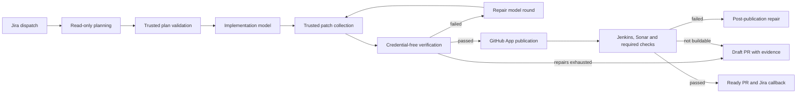
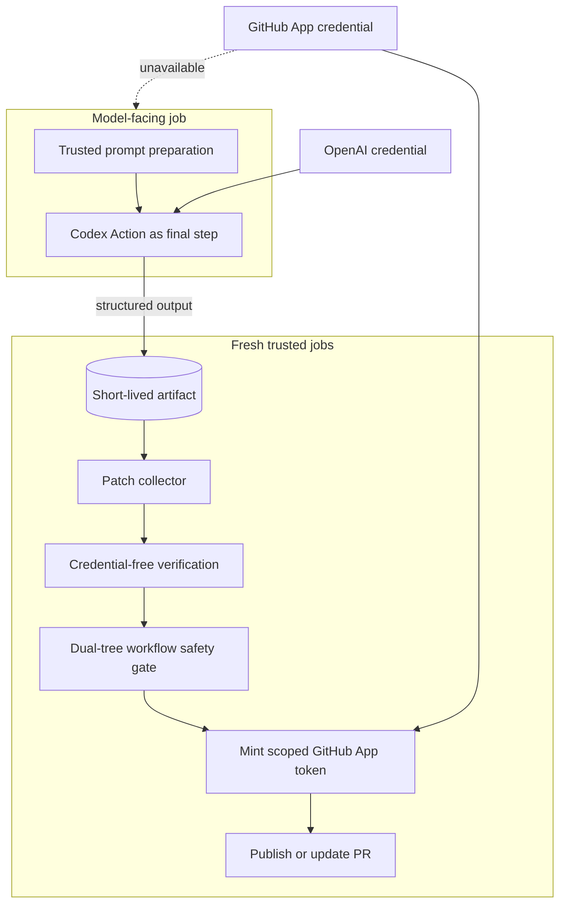
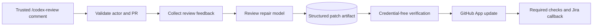

<!-- Generated by .github/scripts/generate-workflow-docs.py. Do not edit directly. -->
# Workflow architecture

The two public reusable workflows remain stable entry points. They delegate to explicitly permissioned stages from the same immutable caller release and transfer model output through artifacts into fresh trusted jobs.

## Jira-to-PR implementation

## Security boundaries

## PR feedback

## Generated component inventory

| Workflow | Name | Role | Jobs | Calls |
|---|---|---|---:|---|
| `codex-generate.yml` | Codex generation stage | Internal reusable stage | 5 | - |
| `codex-implement.yml` | Codex implementation | Public entry point | 6 | `codex-generate.yml`, `codex-plan.yml`, `codex-post-repair.yml`, `codex-post-verify.yml`, `codex-publish.yml`, `codex-verification.yml` |
| `codex-plan.yml` | Codex plan stage | Internal reusable stage | 4 | - |
| `codex-post-repair.yml` | Codex published PR repair | Internal reusable stage | 7 | - |
| `codex-post-verify.yml` | Codex published PR verification | Internal reusable stage | 2 | - |
| `codex-publish.yml` | Codex PR publication | Internal reusable stage | 5 | - |
| `codex-repair-round.yml` | Codex repair and verification round | Internal reusable stage | 3 | - |
| `codex-review-feedback.yml` | Codex PR Review Feedback | Public entry point | 5 | `codex-review-generate.yml`, `codex-review-intake.yml`, `codex-review-publish.yml`, `codex-review-repair.yml`, `codex-review-terminal.yml` |
| `codex-review-generate.yml` | Codex review generation and verification | Internal reusable stage | 4 | - |
| `codex-review-intake.yml` | Codex review intake | Internal reusable stage | 1 | - |
| `codex-review-publish.yml` | Codex review publication | Internal reusable stage | 2 | - |
| `codex-review-repair.yml` | Codex review external repair | Internal reusable stage | 7 | - |
| `codex-review-terminal.yml` | Codex review terminal failure | Internal reusable stage | 1 | - |
| `codex-verification.yml` | Codex verification and repair | Internal reusable stage | 4 | `codex-repair-round.yml`, `codex-verify-initial.yml` |
| `codex-verify-initial.yml` | Codex initial verification | Internal reusable stage | 1 | - |

`codex-post-repair.yml` is intentionally retained as one component even though it is slightly above the nominal 700-line target. Its model, trusted collection, credential-free verification, publication and terminal handling remain separate jobs; splitting it further would add another nested reusable-workflow level to a security-sensitive recovery path.
